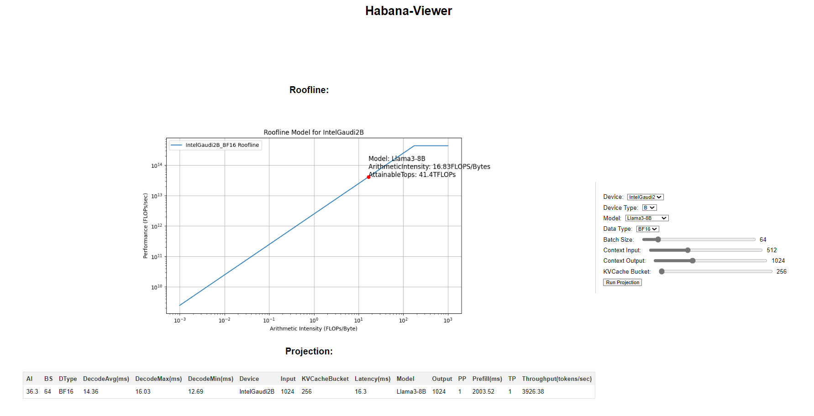
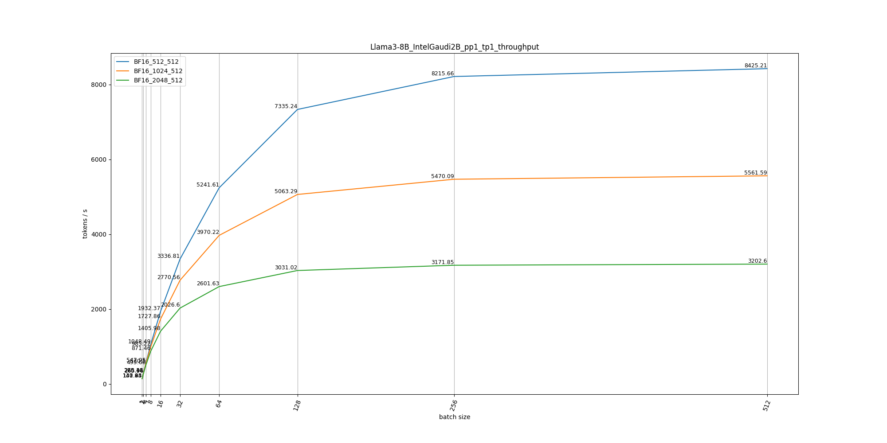
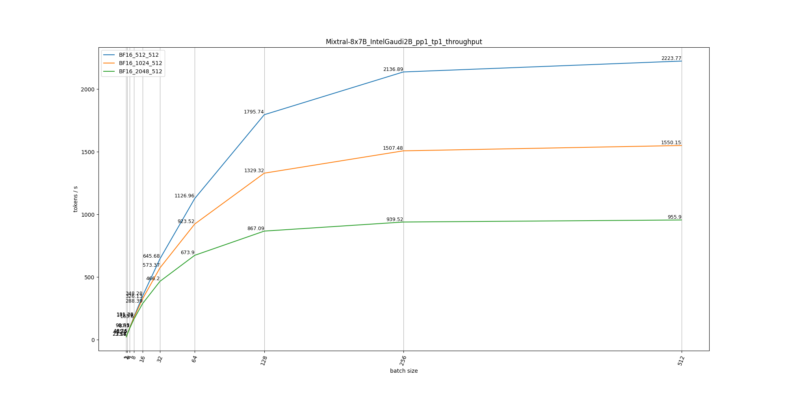

## Habana-Viewer
Habana-Viewer is a projection tool for LLMs performance and memory analysis on Intel Gaudi platform. You can use this tool as a model optimization guidline on Intel Gaudi. This tool contains model projection as well as operation projection.



### Model Projection
|Model Name|Projected Data|
|:------:|:------:|
|Llama2-7B|[Link](./data/model/Llama2-7B/)|
|Llama2-13B|[Link](./data/model/Llama2-13B/)|
|Llama3-8B|[Link](./data/model/Llama3-8B/)|
|Qwen-7B|[Link](./data/model/Qwen-7B/)|
|Qwen-14B|[Link](./data/model/Qwen-14B/)|
|Mixtral-8x7B|[Link](./data/model/Mixtral-8x7B/)|

### Op Projection
|Op Name|Projected Data|
|:------:|:------:|
|Matmul|[Link](./data/operation/Matmul/)|

### Example
#### Model Projection
##### Llama3-8B
- Overall Projection (
    [Details](./data/model/Llama3-8B/IntelGaudi2C_overall_projection.csv)
) /
Attn Projection (
    [Prefill_QK](./data/model/Llama3-8B/IntelGaudi2B_pp1_tp1_BF16_prefill_attn_qk_projection.csv) /
    [Decode_QK](./data/model/Llama3-8B/IntelGaudi2B_pp1_tp1_BF16_decode_attn_qk_projection.csv) /
    [Prefill_SV](./data/model/Llama3-8B/IntelGaudi2B_pp1_tp1_BF16_prefill_attn_sv_projection.csv) /
    [Decode_SV](./data/model/Llama3-8B/IntelGaudi2B_pp1_tp1_BF16_decode_attn_sv_projection.csv)
) /
FFN Projection (
    [Prefill_FFN](./data/model/Llama3-8B/IntelGaudi2B_pp1_tp1_BF16_prefill_ffn_up_projection.csv) /
    [Decode_FFN](./data/model/Llama3-8B/IntelGaudi2B_pp1_tp1_BF16_decode_ffn_up_projection.csv)
)
<!--  -->

##### Llama2-13B
- Overall Projection (
    [Details](./data/model/Llama2-13B/IntelGaudi2C_overall_projection.csv)
) /
Attn Projection (
    [Prefill_QK](./data/model/Llama2-13B/IntelGaudi2B_pp1_tp1_BF16_prefill_attn_qk_projection.csv) /
    [Decode_QK](./data/model/Llama2-13B/IntelGaudi2B_pp1_tp1_BF16_decode_attn_qk_projection.csv) /
    [Prefill_SV](./data/model/Llama2-13B/IntelGaudi2B_pp1_tp1_BF16_prefill_attn_sv_projection.csv) /
    [Decode_SV](./data/model/Llama2-13B/IntelGaudi2B_pp1_tp1_BF16_decode_attn_sv_projection.csv)
) /
FFN Projection (
    [Prefill_FFN](./data/model/Llama2-13B/IntelGaudi2B_pp1_tp1_BF16_prefill_ffn_up_projection.csv) /
    [Decode_FFN](./data/model/Llama2-13B/IntelGaudi2B_pp1_tp1_BF16_decode_ffn_up_projection.csv)
)
<!--  -->

##### Qwen-7B
- Overall Projection (
    [Details](./data/model/Qwen-7B/IntelGaudi2B_overall_projection.csv)
) /
Attn Projection (
    [Prefill_QK](./data/model/Qwen-7B/IntelGaudi2B_pp1_tp1_BF16_prefill_attn_qk_projection.csv) /
    [Decode_QK](./data/model/Qwen-7B/IntelGaudi2B_pp1_tp1_BF16_decode_attn_qk_projection.csv) /
    [Prefill_SV](./data/model/Qwen-7B/IntelGaudi2B_pp1_tp1_BF16_prefill_attn_sv_projection.csv) /
    [Decode_SV](./data/model/Qwen-7B/IntelGaudi2B_pp1_tp1_BF16_decode_attn_sv_projection.csv)
) /
FFN Projection(
    [Prefill_FFN](./data/model/Qwen-7B/IntelGaudi2B_pp1_tp1_BF16_prefill_ffn_up_projection.csv) /
    [Decode_FFN](./data/model/Qwen-7B/IntelGaudi2B_pp1_tp1_BF16_decode_ffn_up_projection.csv)
)
<!--  -->

##### Mixtral-8x7B
- Overall Projection (
    [Details](./data/model/Mixtral-8x7B/IntelGaudi2B_overall_projection.csv)
) /
Attn Projection (
    [Prefill_QK](./data/model/Mixtral-8x7B/IntelGaudi2B_pp1_tp1_BF16_prefill_attn_qk_projection.csv) /
    [Decode_QK](./data/model/Mixtral-8x7B/IntelGaudi2B_pp1_tp1_BF16_decode_attn_qk_projection.csv) /
    [Prefill_SV](./data/model/Mixtral-8x7B/IntelGaudi2B_pp1_tp1_BF16_prefill_attn_sv_projection.csv) /
    [Decode_SV](./data/model/Mixtral-8x7B/IntelGaudi2B_pp1_tp1_BF16_decode_attn_sv_projection.csv)
) /
FFN Projection (
    [Prefill_FFN](./data/model/Mixtral-8x7B/IntelGaudi2B_pp1_tp1_BF16_prefill_ffn_up_projection.csv) /
    [Decode_FFN](./data/model/Mixtral-8x7B/IntelGaudi2B_pp1_tp1_BF16_decode_ffn_up_projection.csv)
)
<!--  -->

<!-- #### Operation Projection -->

### Command
#### Model Projection
1. Simpily run with **[run_model_projection.py](./run_model_projection.py)** and the results will be saved to folder "data/model", one can modify **proj_cfg** in main.
    ```sh
    python run_model_projection.py
    ```
2. Simpily run with **[python habana_viewer_server.py](./habana_viewer_server.py)** and the results will show up on localhost.
    ```sh
    python python habana_viewer_server.py
    ```
<!-- 3. Run with jupyter notebook: **run_projection.ipynb** for simpily visualization. -->
#### Operation Projection
1. Simpily run with **[run_op_projection.py](./run_op_projection.py)** and the results will be saved to folder "data/operation", same with model projection, one can modify **proj_cfg** in main.
    ```sh
    python run_op_projection.py
    ```


### Todo
1. Currently only cover single card perf projection, will support multi-card / multi-node.
2. Will cover more models / operations.