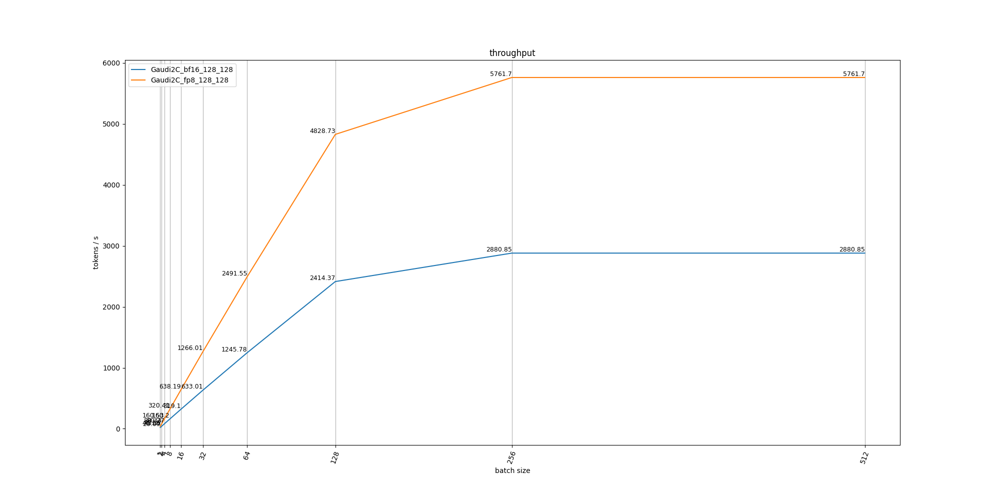
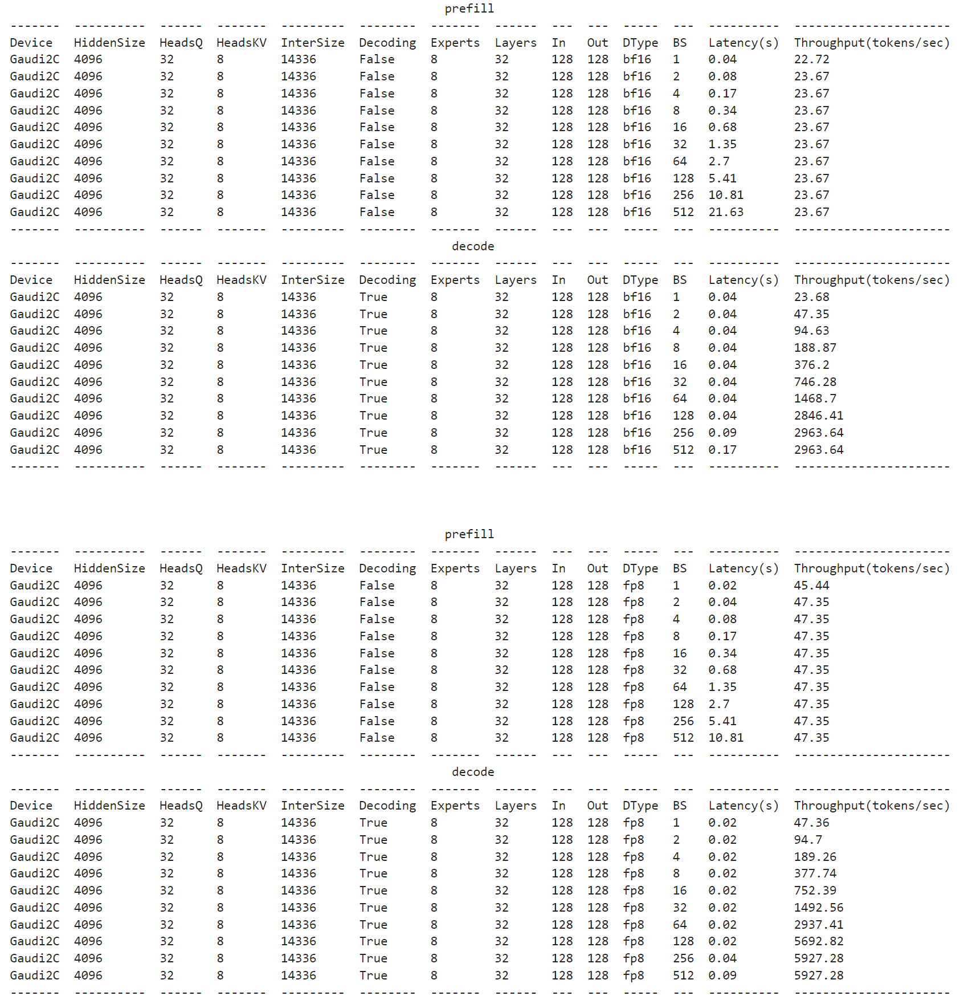
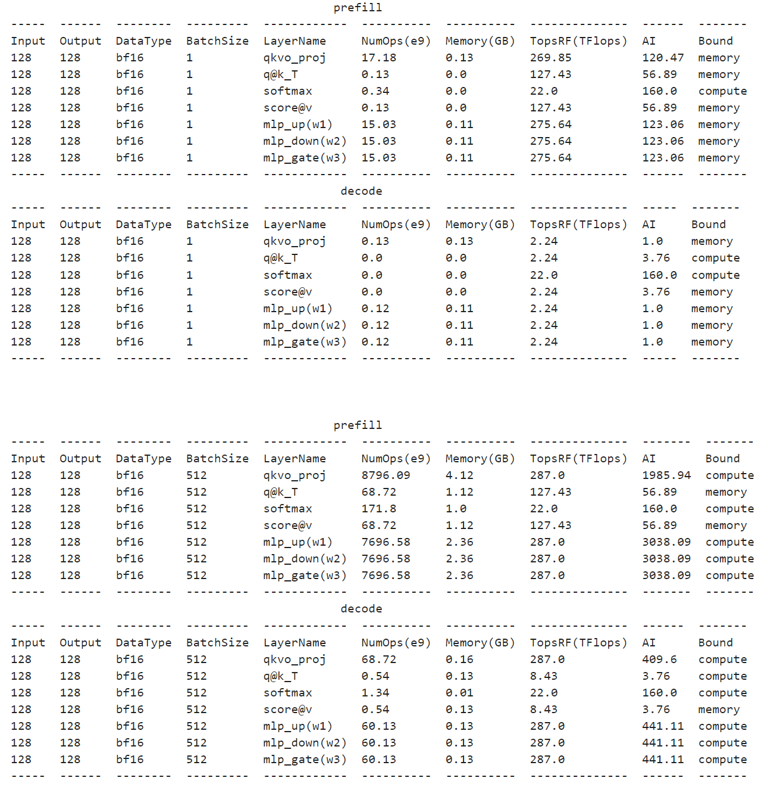

# projection

## Command
1. simpily run with **moe_projection.py**
    ```sh
    python moe_projection.py
    ```
2. run with jupyter notebook: **projection.ipynb**

## Example
### Mixtral-8x7B
#### Projection Plot

#### Projection Table

#### Bound Analysis


## Todo
1. Currently only with single card, will support multi-card / multi-node.
2. Only cover Mixtral-8x7B, will cover more.