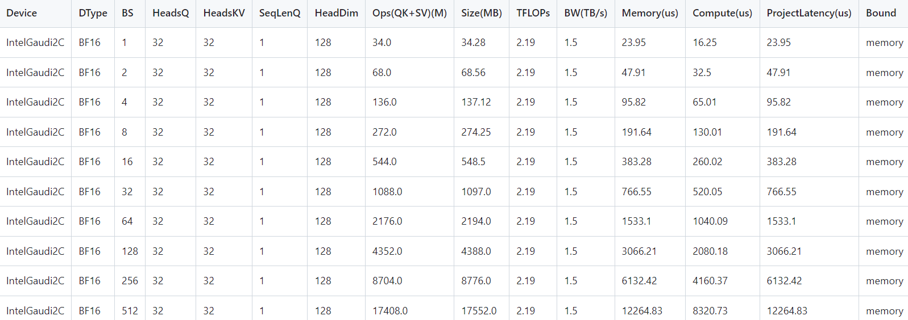
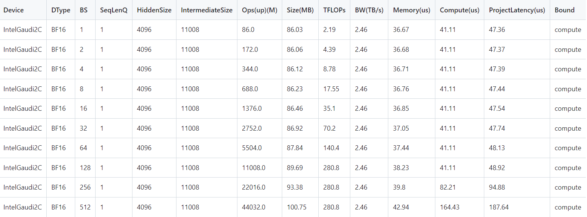
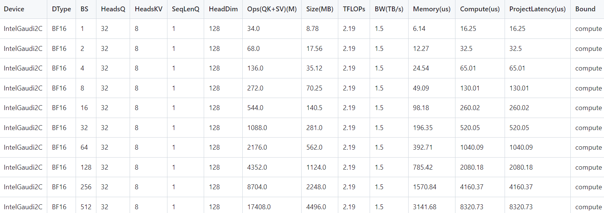
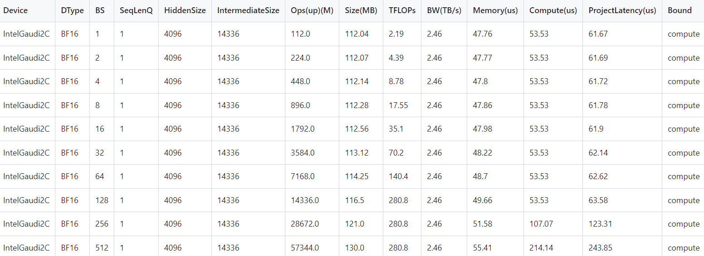

# projection

## Command
1. Simpily run with **run_projection.py** and the results will be saved to folder "data" and "figure".
    ```sh
    python run_projection.py
    ```
2. Run with jupyter notebook: **run_projection.ipynb** for simpily visualization.

## Example

### Compute
#### Llama2-7B
- Overall Projection


- Attention (QK + SV) Projection


- FFN (UP) Projection


#### Mixtral-8x7B
- Overall Projection


- Attention (QK + SV) Projection


- FFN (UP) Projection


<!-- ##### Projection Table

##### Bound Analysis


### Memory
 -->

## Todo
1. Currently only with single card, will support multi-card / multi-node.
2. Only cover Llama2-7B, Mixtral-8x7B, will cover more models.