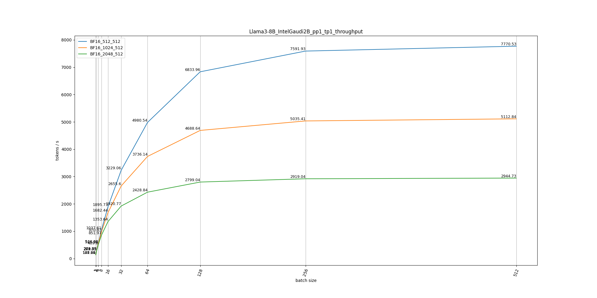

# projection
Habana-Viewer is a projection tool for LLMs performance and memory analysis on Intel Gaudi platform. You can use this tool as a model optimization guidline on Intel Gaudi.

## Command
1. Simpily run with **run_projection.py** and the results will be saved to folder "data".
    ```sh
    python run_projection.py
    ```
2. Run with jupyter notebook: **run_projection.ipynb** for simpily visualization.

## Models
|Model Name|Projected Data|
|:------:|:------:|
|Llama2-7B|[Link](./data/Llama2-7B/)|
|Llama2-13B|[Link](./data/Llama2-13B/)|
|Llama3-8B|[Link](./data/Llama3-8B/)|
|Qwen-7B|[Link](./data/Qwen-7B/)|
|Qwen-14B|[Link](./data/Qwen-14B/)|
|Mixtral-8x7B|[Link](./data/Mixtral-8x7B/)|

## Example

### Compute
#### Llama2-13B
- Overall Projection [(more details in table)](./data/Llama2-13B/IntelGaudi2C_overall_projection.csv)


- Attn Projection
    - Q@K_T
    [Prefill](./data/Llama2-13B/IntelGaudi2B_pp1_tp1_BF16_prefill_attn_qk_projection.csv) |
    [Decode](./data/Llama2-13B/IntelGaudi2B_pp1_tp1_BF16_decode_attn_qk_projection.csv)

    - Score@V
    [Prefill](./data/Llama2-13B/IntelGaudi2B_pp1_tp1_BF16_prefill_attn_sv_projection.csv) |
    [Decode](./data/Llama2-13B/IntelGaudi2B_pp1_tp1_BF16_decode_attn_sv_projection.csv)

- FFN Projection
[Prefill](./data/Llama2-13B/IntelGaudi2B_pp1_tp1_BF16_prefill_ffn_up_projection.csv) |
[Decode](./data/Llama2-13B/IntelGaudi2B_pp1_tp1_BF16_decode_ffn_up_projection.csv)

#### Llama3-8B
- Overall Projection [(more details in table)](./data/Llama3-8B/IntelGaudi2C_overall_projection.csv)


- Attn Projection
    - Q@K_T
    [Prefill](./data/Llama3-8B/IntelGaudi2B_pp1_tp1_BF16_prefill_attn_qk_projection.csv) |
    [Decode](./data/Llama3-8B/IntelGaudi2B_pp1_tp1_BF16_decode_attn_qk_projection.csv)

    - Score@V
    [Prefill](./data/Llama3-8B/IntelGaudi2B_pp1_tp1_BF16_prefill_attn_sv_projection.csv) |
    [Decode](./data/Llama3-8B/IntelGaudi2B_pp1_tp1_BF16_decode_attn_sv_projection.csv)

- FFN Projection
[Prefill](./data/Llama3-8B/IntelGaudi2B_pp1_tp1_BF16_prefill_ffn_up_projection.csv) |
[Decode](./data/Llama3-8B/IntelGaudi2B_pp1_tp1_BF16_decode_ffn_up_projection.csv)

#### Qwen-7B
- Overall Projection [(more details in table)](./data/Qwen-7B/IntelGaudi2B_overall_projection.csv)


- Attn Projection
    - Q@K_T
    [Prefill](./data/Qwen-7B/IntelGaudi2B_pp1_tp1_BF16_prefill_attn_qk_projection.csv) |
    [Decode](./data/Qwen-7B/IntelGaudi2B_pp1_tp1_BF16_decode_attn_qk_projection.csv)

    - Score@V
    [Prefill](./data/Qwen-7B/IntelGaudi2B_pp1_tp1_BF16_prefill_attn_sv_projection.csv) |
    [Decode](./data/Qwen-7B/IntelGaudi2B_pp1_tp1_BF16_decode_attn_sv_projection.csv)

- FFN Projection
[Prefill](./data/Qwen-7B/IntelGaudi2B_pp1_tp1_BF16_prefill_ffn_up_projection.csv) |
[Decode](./data/Qwen-7B/IntelGaudi2B_pp1_tp1_BF16_decode_ffn_up_projection.csv)

#### Mixtral-8x7B
- Overall Projection [(more details in table)](./data/Mixtral-8x7B/IntelGaudi2B_overall_projection.csv)


- Attn Projection
    - Q@K_T
    [Prefill](./data/Mixtral-8x7B/IntelGaudi2B_pp1_tp1_BF16_prefill_attn_qk_projection.csv) |
    [Decode](./data/Mixtral-8x7B/IntelGaudi2B_pp1_tp1_BF16_decode_attn_qk_projection.csv)

    - Score@V
    [Prefill](./data/Mixtral-8x7B/IntelGaudi2B_pp1_tp1_BF16_prefill_attn_sv_projection.csv) |
    [Decode](./data/Mixtral-8x7B/IntelGaudi2B_pp1_tp1_BF16_decode_attn_sv_projection.csv)

- FFN Projection
[Prefill](./data/Mixtral-8x7B/IntelGaudi2B_pp1_tp1_BF16_prefill_ffn_up_projection.csv) |
[Decode](./data/Mixtral-8x7B/IntelGaudi2B_pp1_tp1_BF16_decode_ffn_up_projection.csv)


## Todo
1. Currently only cover single card perf projection, will support multi-card / multi-node.
2. will cover more models.