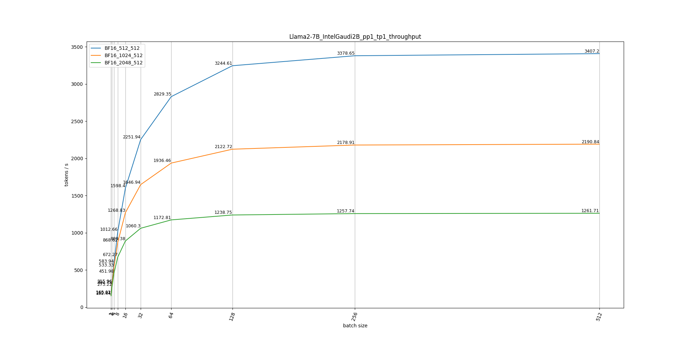
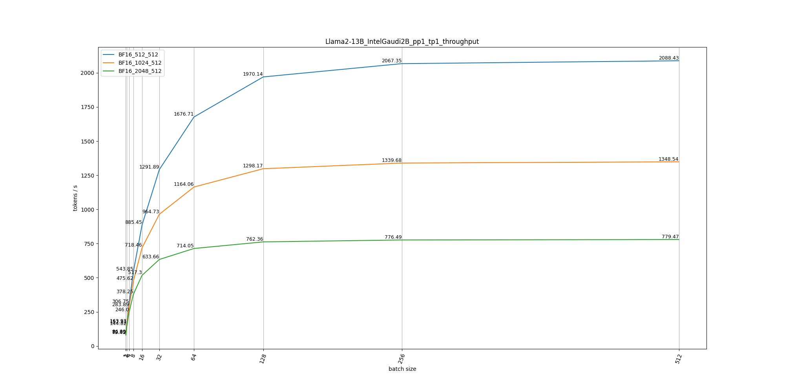

# projection

## Command
1. Simpily run with **run_projection.py** and the results will be saved to folder "data".
    ```sh
    python run_projection.py
    ```
2. Run with jupyter notebook: **run_projection.ipynb** for simpily visualization.

## Example

### Compute
#### Llama2-7B
- Overall Projection


- Overall Projection Table
[Llama2-7B Overall Projection](./data/Llama2-7B/IntelGaudi2B_overall_projection.csv)

- Attention BMM Projection
[Llama2-7B Attn BMM Prefill](./data/Llama2-7B/IntelGaudi2B_pp1_tp1_BF16_prefill_attn_qksv\(bmm\)_projection.csv) |
[Llama2-7B Attn BMM Decode](./data/Llama2-7B/IntelGaudi2B_pp1_tp1_BF16_decode_attn_qksv\(bmm\)_projection.csv)

- FFN MM Projection
[Llama2-7B FFN MM Prefill](./data/Llama2-7B/IntelGaudi2B_pp1_tp1_BF16_prefill_ffn_up\(mm\)_projection.csv) |
[Llama2-7B FFN MM Decode](./data/Llama2-7B/IntelGaudi2B_pp1_tp1_BF16_decode_ffn_up\(mm\)_projection.csv)

#### Llama2-13B
- Overall Projection


- Overall Projection Table
[Llama2-13B Overall Projection](./data/Llama2-13B/IntelGaudi2B_overall_projection.csv)

- Attention BMM Projection
[Llama2-13B Attn BMM Prefill](./data/Llama2-13B/IntelGaudi2B_pp1_tp1_BF16_prefill_attn_qksv\(bmm\)_projection.csv) |
[Llama2-13B Attn BMM Decode](./data/Llama2-13B/IntelGaudi2B_pp1_tp1_BF16_decode_attn_qksv\(bmm\)_projection.csv)

- FFN MM Projection
[Llama2-13B FFN MM Prefill](./data/Llama2-13B/IntelGaudi2B_pp1_tp1_BF16_prefill_ffn_up\(mm\)_projection.csv) |
[Llama2-13B FFN MM Decode](./data/Llama2-13B/IntelGaudi2B_pp1_tp1_BF16_decode_ffn_up\(mm\)_projection.csv)

#### Qwen-7B
- Overall Projection


- Overall Projection Table
[Qwen-7B Overall Projection](./data/Qwen-7B/IntelGaudi2B_overall_projection.csv)

- Attention BMM Projection
[Qwen-7B Attn BMM Prefill](./data/Qwen-7B/IntelGaudi2B_pp1_tp1_BF16_prefill_attn_qksv\(bmm\)_projection.csv) |
[Qwen-7B Attn BMM Decode](./data/Qwen-7B/IntelGaudi2B_pp1_tp1_BF16_decode_attn_qksv\(bmm\)_projection.csv)

- FFN MM Projection
[Qwen-7B FFN MM Prefill](./data/Qwen-7B/IntelGaudi2B_pp1_tp1_BF16_prefill_ffn_up\(mm\)_projection.csv) |
[Qwen-7B FFN MM Decode](./data/Qwen-7B/IntelGaudi2B_pp1_tp1_BF16_decode_ffn_up\(mm\)_projection.csv)

#### Qwen-14B
- Overall Projection


- Overall Projection Table
[Qwen-14B Overall Projection](./data/Qwen-14B/IntelGaudi2B_overall_projection.csv)

- Attention BMM Projection
[Qwen-14B Attn BMM Prefill](./data/Qwen-14B/IntelGaudi2B_pp1_tp1_BF16_prefill_attn_qksv\(bmm\)_projection.csv) |
[Qwen-14B Attn BMM Decode](./data/Qwen-14B/IntelGaudi2B_pp1_tp1_BF16_decode_attn_qksv\(bmm\)_projection.csv)

- FFN MM Projection
[Qwen-14B FFN MM Prefill](./data/Qwen-14B/IntelGaudi2B_pp1_tp1_BF16_prefill_ffn_up\(mm\)_projection.csv) |
[Qwen-14B FFN MM Decode](./data/Qwen-14B/IntelGaudi2B_pp1_tp1_BF16_decode_ffn_up\(mm\)_projection.csv)

#### Mixtral-8x7B
- Overall Projection


- Overall Projection Table
[Mixtral-8x7B Overall Projection](./data/Mixtral-8x7B/IntelGaudi2B_overall_projection.csv)

- Attention BMM Projection
[Mixtral-8x7B Attn BMM Prefill](./data/Mixtral-8x7B/IntelGaudi2B_pp1_tp1_BF16_prefill_attn_qksv\(bmm\)_projection.csv) |
[Mixtral-8x7B Attn BMM Decode](./data/Mixtral-8x7B/IntelGaudi2B_pp1_tp1_BF16_decode_attn_qksv\(bmm\)_projection.csv)

- FFN MM Projection
[Mixtral-8x7B FFN MM Prefill](./data/Mixtral-8x7B/IntelGaudi2B_pp1_tp1_BF16_prefill_ffn_up\(mm\)_projection.csv) |
[Mixtral-8x7B FFN MM Decode](./data/Mixtral-8x7B/IntelGaudi2B_pp1_tp1_BF16_decode_ffn_up\(mm\)_projection.csv)


## Todo
1. Currently only cover single card perf projection, will support multi-card / multi-node.
2. Only cover Llama2-7B, Qwen-7B and Mixtral-8x7B, will cover more models.