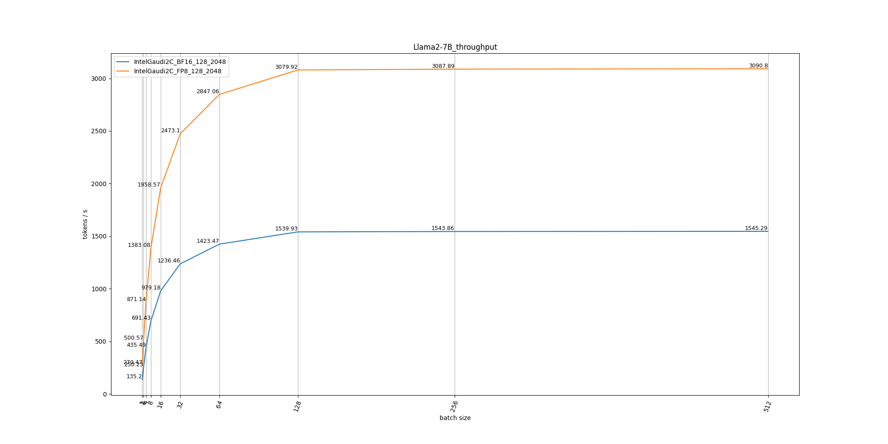
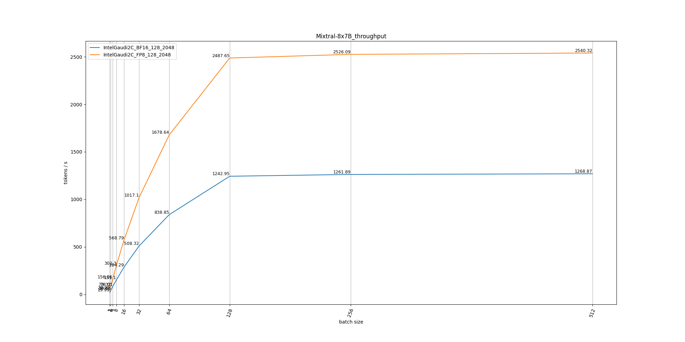

# projection

## Command
1. simpily run with **moe_projection.py**
    ```sh
    python moe_projection.py
    ```
2. run with jupyter notebook: **moe_projection.ipynb**

## Example

### Compute
#### Llama2-7B



#### Mixtral-8x7B

<!-- ##### Projection Table

##### Bound Analysis


### Memory
 -->

## Todo
1. Currently only with single card, will support multi-card / multi-node.
2. Only cover Llama2-7B, Mixtral-8x7B, will cover more models.